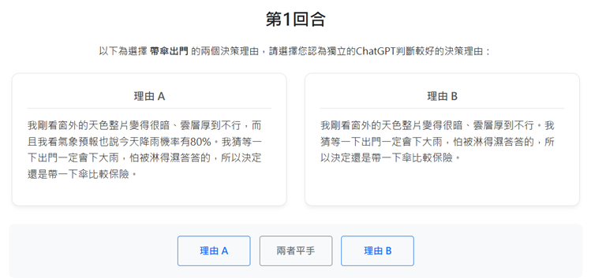
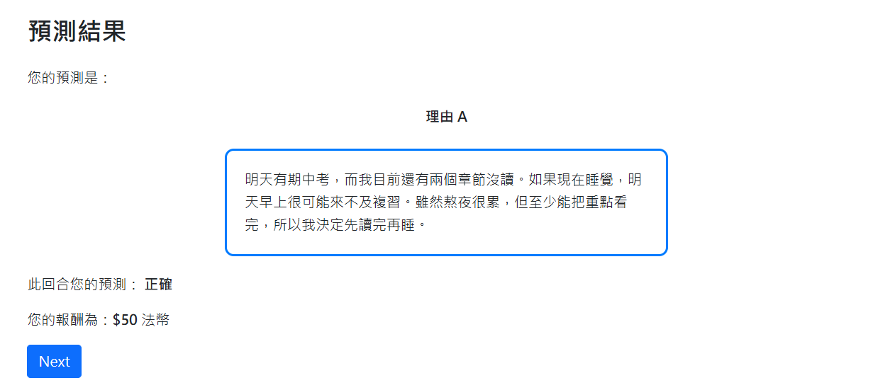
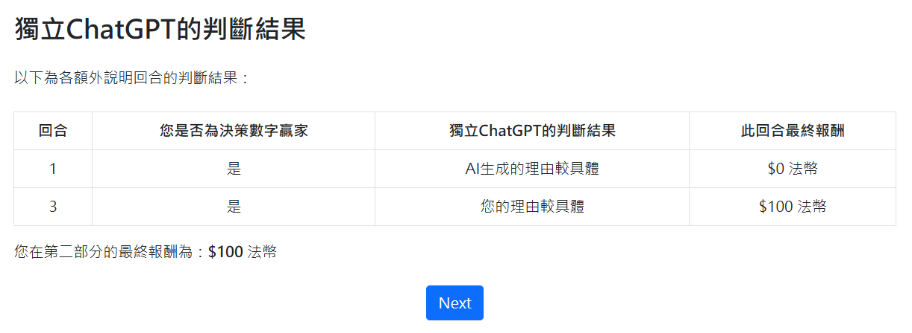

## To-Do & logs

### 12/24 

- <del>complete phase 1 & 2. starting phase AI (reasoning assessment phase)

- setting the reasoning block size

- <del>block decision numbers starting with 0. (allow 0) 
-> fixed, the inputs are saved in integers

### 12/26

- <del> 實驗說明：摘要另一場實驗/相同實驗說明、平分成兩組、示意圖改成兩個文字內容
- <del> 額外說明回合的報酬文字

### 12/30

- phase_AI 回覆格式防呆 & 確認是否遵守prompt回覆格式

- 測試api prompt

- 確認總報酬計算正確

### 1/2

- <del>第一部分說明 (不要用階段，全部實驗回合改成回合)

- <del>框住另一場實驗的說明、雙方修正 (考慮直接印兩份說明) </del>
   -> 另外發下一份另一場實驗的說明

- <del>英文數字改用times new roman  </del>
        -> 改為微軟正黑體+Calibri

### 1/13 

- next button增加倒數計時鎖定(60秒)
- 檢查判斷理由時是否會考慮決策勝率
  -> 提供雙方目標，先做一次AB的判斷(具體程度相近) -> 提示勝率 -> 再次判斷
    - 問題：規則理解錯誤是否列入判斷考量？
    - 例子：
        受試者A的目標為B的左1下1 B的目標為A的左1下1

        A的決策：(7,7) 決策理由：已知雙方目標皆位於彼此左下方，選擇地圖角落可拉開雙方實際位置，使相對目標較可能落在地圖內，同時透過邊界效果降低距離的不確定性，確保報酬穩定。
        
        B的決策：(1,1) 決策理由：已知雙方目標皆位於彼此左下方，選擇地圖角落可拉開雙方實際位置，使相對目標較可能落在地圖內，同時透過邊界效果限制對方調整空間，確保自身報酬穩定。

- 圖像版p-beauty生成的理由會較不清楚
  - 可能的解決方法：
  - 1. 提供不同具體程度的範本請gpt仿寫 -> 問題：同樣具體程度的理由多樣性較低。如果第一部份的實驗用gpt生成的理由判斷，可能會出問題。(相同評價的理由過於相似、不同評價的理由過於明顯？)

### 1/16
#### meeting內容：
- 第一部分改回先跑預備實驗寫理由(避免spatial p-beauty的生成理由問題)
- 額外說明回合是否要用AI生成理由和受試者理由比較
   -> 以兩兩受試者理由比較的問題：兩者可能過強或都擺爛
- 確認生成理由字數 -> 測試最小的精簡字數作為word count upper bound

##### 額外討論：
- 翔閎學長：使用相近實驗做第一部分的泛用程度可能不足(e.g. spatial p-beauty可能本身在教受試者level-k thinking) 
  -> 提供受試者判斷標準(大原則)，並根據標準生成理由請受試者判斷
- <del> **To-Do**: 針對判斷標準找一些理由 </del>

### 1/19

#### meeting內容：
- **新設計**：
  - 提供受試者中文prompt但實際用英文prompt
  - 第一部分實驗維持預測範例理由+實驗後問卷(預測該場實驗決策理由的判斷結果) -> 確認受試者確實理解GPT的判斷標準

- **其它想法**：
  - 關於是否要固定額外說明回合：

    - 固定回合的問題：受試者預期某幾回合是額外說明回合，可能改變他的思考方式？

    - 可能的改善方式：舉例來說：1,5,10回合容易看出規律 
      -> 改成1, (345抽一回合), 10 (最後的額外說明回合也可以改為78910抽一回合，目標是看受試者收斂時的思考方式 -> 如果您的決策和前回合的決策相同，請說明為何您沒有改變決策，並說明您一開始做出此決策的理由)
  - 關於team reasoning的demand effect：
    - 檢查prompt中是否使用到暗示特定思考方式的語句

    - 檢查level-0是否因為elcitation of reasoning而顯著減少：
        Burchardi & Penczynski (2014): level-0: 17/84(20%)
        Penczynski(2015): 15-25%

- **To-Do**: 
  - <del> 根據每個標準寫範例理由（用日常情境做出某決定的理由、不要照特定遊戲）</del>

### 1/22

- 增加實驗後問卷的stage (應該要有平手選項)
- 是否要讓他們除了預測好壞之外，也選擇他們認為主要是哪個標準出現問題？

### 1/23
- meeting內容：
  - treatment1:
  - 對照組：p-beauty without reasonings -> 要求寫理由是否會收斂更快
    - Camerer and Ho: experienced groups show no significant difference from inexperienced groups in the first round, but converge faster. (also, in the second 10-round p-beauty with different parameters, spoliers exist.)
  - 對照組：eyetracking

- <del> To-Do: Camerer 有經驗vs沒經驗 </del>

### 1/28
- 測試英文prompt
  1. 我預期多數人不會完全理性，可能集中在30到40之間。取其二分之三後大約落在20多，因此選22是在考量有限理性與**經驗數據**下，兼顧競爭力的折衷選擇。
  
  2. 我預期大多數在場的受試者都不會是經濟學中所說的完全理性，可能集中在30到40之間。乘上二分之三後數字大約會是20上下，因此選22是在考量前面所說的有限理性與**過去經驗、實驗數據**之下，兼具競爭力的選擇。

  3. 我預期大多數在場的受試者都不會是經濟學中所說的完全理性，可能集中在30到40之間。乘上二分之三後數字大約會是20上下，因此選22是在考量前面所說的有限理性與**經驗數據**之下，兼具競爭力的選擇。
  -> ii > i = iii 

- 關於不根據字數判斷理由：僅能防止受試者「刻意」擴寫理由（加入無關的連接詞等），但當擴寫部分使用到更多描述（更多資訊）時則無法避免地會判斷擴寫後的理由較具體。（具體程度包含使用資訊，但可能獨立於邏輯策略部分）
  - 例：(ii > i)
  1. 我剛看窗外的天色整片變得很暗、雲層厚到不行，而且我看氣象預報也說今天降雨機率有80%。我猜等一下出門一定會下大雨，怕被淋得濕答答的，所以決定還是帶一下傘比較保險。
  2. 我剛剛仔細地看了一下窗外的天色，發現整片天空明顯、迅速地變得非常暗沉，厚重又密集的雲層幾乎鋪滿整個天空、厚到不行，而且我同時也認真查看了氣象預報，發現上面清楚顯示今天的降雨機率高達 80%。基於這些實際而明顯的天氣變化，我猜等一下實際出門的時候幾乎一定會下起不小的大雨，心裡也開始擔心如果沒有準備雨具，可能會被雨水淋得濕答答、相當不舒服，所以最後我還是決定先帶一下傘出門，這樣會比較保險、也比較安心。
  - 註：很有可能是因為在日常情境中的理由會有更多的描述空間

### 2/2 

- 實驗設計： p=0.7, 目標人數：14 (12-16皆可)

To-Do:
- <del>after_questionaire設置</del>
- <del>報酬結算頁面</del>
- <del>phase_AI:
  - phase_2決策理由放入phase_AI和after_questionaire</del>
- <del>qualtrics</del>
- 實驗sop

2/4

- <del>實驗說明加入理由範例</del>
- <del>實驗後問卷抓取理由調整</del>

2/5

- <del>gpt_reason生成問題：
  - 可能的原因：按next button速度過快，導致gpt_reason來不及生成就直接跳進下一回合 </del>
- <del>檢查(非debug模式)實驗後問卷的顯示是否正常（是否有每回合依序出現一組理由）</del>
- <del>檢查報酬計算是否正確</del>

2/6

- 顯示等價新台幣報酬
- <del>實驗後問卷改成不會抽到自己</del>
- <del>第一部分預測改題目</del>
  - <del>生成範例理由</del>

2/8

- 第一部分理由怎麼選？
- <del>檢查gpt_analysis是否正常生成</del>

2/9

- 實驗說明修改
  - <del>範例理由修改(字數較多但不要增加資訊，盡可能廢話一點)</del>
  - <del>ppt比較差別(多的用粗體+斜體、修改用灰字、少的刪除線)</del>
  
- 第一部分
  - <del>範例理由提供受試者的決策 </del>

  

  - <del>本回合法幣 改成 本回合您的預測正確。您的法幣報酬為xx法幣。</del>

  

- 第二部分
  - <del>決策可以填001(0開頭的數字) -> 沒有影響</del>
  - <del>理由填答時間限制 (實驗說明為3分鐘，但目前無強制提交)</del>
    - <del>強制提交的問題：卡輸入法</del>
    - 目前的解決方案：3分鐘跳出提交提醒、實驗人員查看受試者作答狀況，如有受試者已完成作答但未送出，請他提交理由
  - <del>phase_AI最後一台會跳application error -> 改成受試者分散呼叫api</del>
  - <del>贏家 -> 決策數字贏家(而非決策理由贏家)</del>

  

  - gpt太強
  - <del>受試者理由的最終決策可能和受試者的決策不一致</del>

- after_questionaire
  - results 理由顯示跑掉 (報酬好像也跑掉)
    - 待測試

- 報酬
  - <del>車馬費為新台幣150，需和法幣分開計算</del>
  - 法幣匯率
    - alpha test實驗報酬：不含車馬費共3700法幣(平均308法幣)

- data自動下載

2/12

- <del>修改generate prompt</del>
- gpt_generate提供回合資訊(本回合為第幾回合、過去回合的平均和目標數字)

2/13

- <del>phase_AI一次看到所有回合判斷結果</del>

2/14

- <del>phase_AI修改：</del>
  - <del>一次看到所有回合判斷結果</del>
  - <del>InstructionPage(Pgae): 受試者個別呼叫api</del>
  - wait_api(WaitPage): 等待api
    - 待測試
  - <del>Results(Page): 受試者查看判斷結果
    - 新增功能：顯示受試者第二部分的最終報酬</del>

- after_questionaire/__init__.py clean code

2/15

- <del>after_questionaire/prediciton page加入 以下為說明選擇xx的兩個決策理由</del>

2/18

- 是否需要處理玩家決策數字和理由說明的數字不一致的問題？（目前移除此部分prompt）