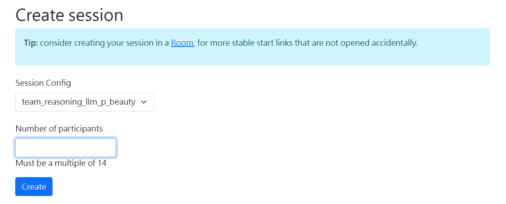

## 實驗前
和曉芳姐確認可以跑實驗的時間+找小幫手
確認後和老師確認點錢時間(實驗前、後皆須確認)

註：如錢箱零錢不夠，原則上是到公館台灣銀行換幣

### step1 Tassel網站開新實驗+寄送邀請

主電腦密碼：tassel

https://www.tassel.econ.ntu.edu.tw/admin/

複製一場剛結束的實驗 -> 我的實驗 -> 指派對象 -> 套用先前儲存的查詢條件 -> 搜尋與檢視-> 全選 -> 去除學號t開頭受試者 -> assign only selected participants -> 此實驗主頁-> 寄送邀請Email -> 記得每天確認報名人數

註1：查詢條件：受試者入學時間>2019 & 限台大學生 & 系統隨機選取300人
註2：寄太多信要到slack recruitment letter告知

## 實驗前30分鐘

### step1 印製空白受試者收據、實驗說明

D槽 -> 公用檔案 -> 紙本資料 -> 空白受試者收據
D槽 -> team_reasoning_p_beauty -> experiment_instruction -> experimental_instruction_new_design.pdf (影印前確認為雙面黑白)

### step2 印製受試者名單+拿錢箱給曉芳姐

實驗主頁 -> 已登記對象 -> 複製名單到excel列印 (額外準備外籍生空白收據)

D槽 -> 公用檔案 -> 紙本資料 -> 空白受試者收據

### step3 heroku deploy

- 固定網址：
    https://team-reasoning-llm-p-beauty-c2bfda91d091.herokuapp.com/login

- username = admin
  password = tassel

修改實驗人數並創建新session：

登入heroku -> dashboard -> app(team-reasoning-llm-p-beauty) -> settings -> Reveal Config Vars -> 將`NUM_PARTICIPANT`設定為該場實驗人數 -> save 

-> 進到otree網址 -> Sessions -> Create New Session -> 輸入實驗人數`NUM_PARTICIPANT`(下方應顯示must be a multiple of `NUM_PARTICIPANT`) 

### step4 開受試者電腦

複製受試者連結到D:/ztree_host/hsun並創建txt檔(檔名為yymmdd) -> 依照位置順序到每台電腦複製ztree_host裡的txt檔對應連結 -> 在Microsoft Edge開啟連結 -> 按F11開啟全螢幕

### step5 播放投影片

筆電投影 -> 操控投影幕(All on -> 電腦1/VGA1) -> 畫面停在實驗說明

### step6 報到

實驗開始前約5分鐘，確認受試者到場狀況 -> 請他們排隊並準備學生證、身分證(外籍生準備居留證，需拍照紀錄以方便報帳) -> 核對先前列印的受試者名單

人數到齊(或接近到齊)後，依報到順序入座(位子可以隨機) -> 如果人數足夠，可準時開始 & 準時到場但未能參加實驗的受試者可以拿到車馬費100元

如人數不夠但接近，可以電話詢問未到場受試者是否來得及到場(等待約5-10分鐘) or 附近抓人做實驗 

如人數還是不夠，則實驗結束(發放車馬費100元)

詢問是否需要上廁所 -> 拉隔板準備開始

## 實驗開始

### step1 填寫log紀錄實驗情況

log包含以下內容(實驗開始/結束時間、受試者人數、主試者、小幫手、最終整體報酬)

### step2 發放第一部分實驗說明

搭配投影片說明範例理由，唸完說明後請受試者按next button開始實驗

### step3 發放第二部分實驗說明

完成決策和理由書寫後，進入api判斷階段。受試者電腦可能會短暫卡頓，注意實驗狀況並請受試者稍作等待

### step4 發放實驗後問卷實驗說明

注意受試者是否完成填答

### step5 實驗結束，填寫qualtrics個人資料

請受試者填寫個人資料以領取報酬。如有戶籍地址等問題請受試者查看身分證背面(上面有寫)，郵遞區號在主電腦旁邊有貼一張對應表可以給受試者看。

### step6 處理pay檔和receipt

待補...

### step7 回收實驗說明

請小幫手回收所有實驗說明，實驗說明不可以帶出實驗室。(如實驗說明有更新需要銷毀，要用靠窗排最裡面的碎紙機)

### step8 發放報酬

和受試者說明現在要發放報酬，唸到學號的受試者可以帶著隨身物品到櫃檯領取報酬。

#### 流程： 
唸學號 -> 把收據拿給曉芳姐 -> 請受試者到櫃檯等待 -> 領取、確認報酬 + 簽收 -> 唸下一個學號

## 實驗結束

### step1 data依分類儲存並上傳到google drive

從heroku下載該場實驗data的All apps(選取Excel CSV)、Page_times(選取Excel CSV)，分別存在xx資料夾。

從 Login | Qualtrics = > Data & Analysis (資料與分析) = > Add Filter (新增篩選器) = > Today (調查中繼資料 => 紀錄的日期 => 今天)= > Export & Import (匯入和匯出) = > Export Data (匯出資料) = > Excel，下載Qualtrics檔，儲存在/TT/qualtrics資料夾。

儲存各式data，檔名為...。

### step2 更改tassel實驗狀態

到該場實驗頁面將實驗狀態改為 `已結束`

### step3 點錢、準備下一場實驗

通知老師實驗總報酬金額 + 點錢 (+ 換錢捕錢)，並告知下次實驗時間

和曉芳姐確認下次實驗時間、招募小幫手
-> 重複以上步驟(寄送實驗邀請信)

***

## 附錄：更改treatment設定or版本更新

### step1 本地修改 & 測試

修改程式碼 -> 本地存檔 & 測試(otree devserver)

### step2 heroku deploy

1. 開啟終端機 -> `cd C:\otree\otree_code`

2. 存入Git -> 
   
    `git add .`
    `git commit -m "treatment adjustment"`
    (commit message)

3. 推送到heroku -> `git push heroku main`
   
    (確認出現 `remote: Verifying deploy... done.`)

4. 同步資料庫(修改Constants或欄位時必要) 注意！ -> 
   
   `heroku run otree resetdb` (**這將刪除heroku上現有所有實驗數據！**)

### step3 實驗室受試者電腦設置

1. 取得實驗網址：終端機輸入`heroku open`

    註：admin不可用時，執行`heroku config:set OTREE_AUTH_LEVEL=STUDY -a team-reasoning-llm-p-beauty`

    STUDY(正式實驗)/DEMO

2. 建立session：
   - username = admin
   - password = tassel